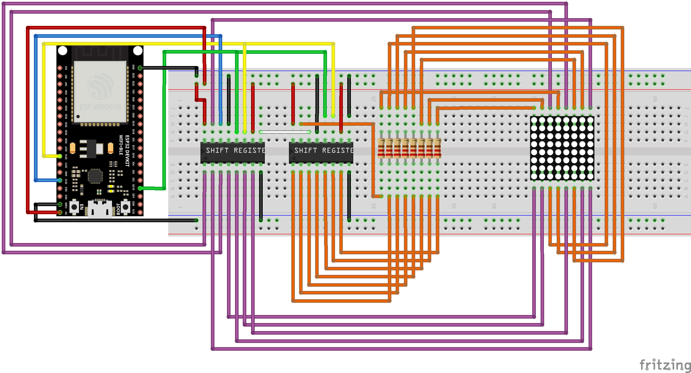

# LED Matrix Animation
The LED Matrix Animation project is designed to display animations on an 8x8 LED matrix using an ESP32 microcontroller. This project utilizes the FreeRTOS operating system for task management and timing.

This project serves as a demonstration of controlling an LED matrix and creating simple animations using the ESP-IDF framework.

### Features
- **LED Matrix Control**: Display animations on an 8x8 LED matrix.
- **Frame Animation**: Cycle through different frames to create an animation effect.
- **Timer-Based Frame Update**: Use a FreeRTOS timer to update the displayed frame at regular intervals.

### Components
- **ESP32**: The microcontroller used for processing and control.
- **8x8 LED Matrix**: The display used to show animations.
- **Shift Registers** (SN74HC595N): Used to control the rows and columns of the LED matrix.
- **220 Ohm Resistors**: Used to limit the current to the LEDs.

### How It Works
1. **Setup**: Initialize the GPIO pins for the LED matrix and configure the timer for frame updates.
2. **Frame Update**: Use a timer callback to cycle through different animation frames.
3. **Display Frame**: Update the LED matrix to display the current frame.

### About TWDT Reset
You will notice while going through my code that I reset the Task WatchDog Timer (TWDT) on each loop. It is important to do so because, without it, the board would reset every 5 seconds due to continuous looping, causing a black screen for a few milliseconds.

An alternative approach is to be to disable the Task WatchDog Timer (TWDT) but I would not recommend you to do that. If you prefer not to work around the TWDT, you can increase the tick rate. This adjustment allows you to call `vTaskDelay` with a value less than 10ms, preventing the flicker effect. Consequently, the TWDT can reset itself automatically.

### Code Overview
- **setup()**: Configures the GPIO settings for the LED matrix.
- **setup_timer()**: Configures and starts the FreeRTOS timer for frame updates.
- **setRegister()**: Sets the row and column values for the LED matrix.
- **timerCallback()**: Updates the current frame index for the animation.
- **app_main()**: Main application loop that continuously updates the LED matrix with the current frame.

### Animation Frames
The project includes predefined frames for a simple Pacman ghost animation. The frames are stored in arrays and cycled through to create this animation effect :

    

